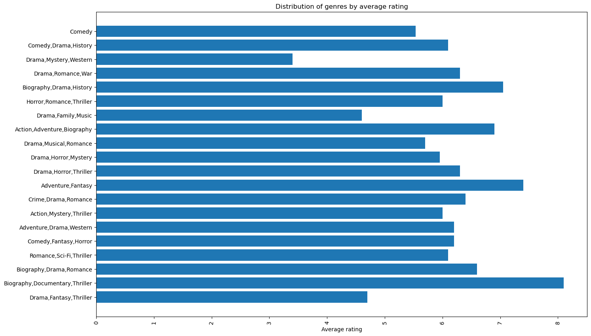
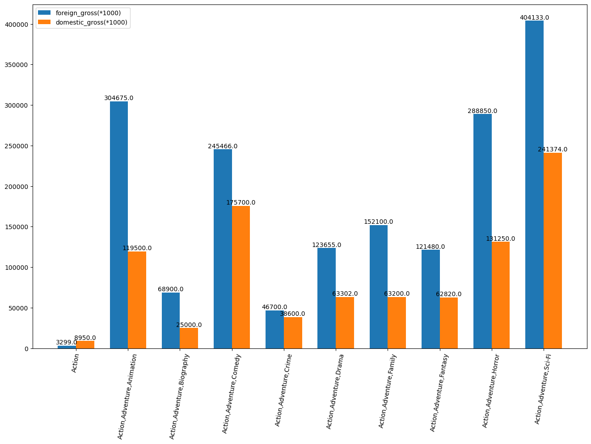
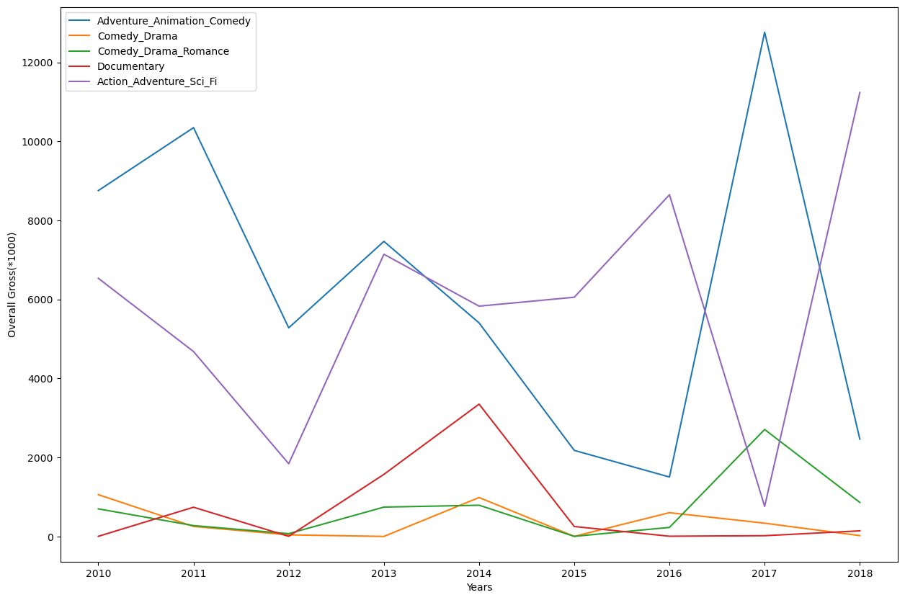

## Investigating Box Office Success: Disseminating Useful Knowledge for Microsoft's New Movie Studio

Photo by <a href="https://unsplash.com/s/photos/microsoft">Matthew Manuel</a> on <a href="https://unsplash.com/s/photos/microsoft">Unsplash</a>

#### Overview

In this project will use exploratory data analysis in order to determine what kinds of movies are currently performing the best at the box office and to provide suggestions for what kinds of movies to produce.

### Business Understanding

Microsoft must be considering a number of questions now that they have a new movie studio.What genres of movies are performing well in the industry, for example, can be one of the queries. What kind of movies should they make, and why?

The project's goal is to use exploratory data analysis approaches to learn how movies are doing right now at the box office. The project's EDA will look at and analyze a variety of movie-related data, including box genres, release dates, production costs, audience ratings, and other pertinent elements.

Our job is to investigate box office successes as we work to establish a prosperous film company. We will get insightful information that will help the head of Microsoft's new movie studio choose the kinds of movies to produce by thoroughly analyzing the existing landscape of film industry successes. These conclusions will act as benchmarks to direct the studio toward fruitful endeavors.

The success criteria for this project is to be able output insights that can be transformed into decisions that will be later on be implemented. These insights should enable the CEO of Microsoft's movie studio to make well-informed decisions about the kinds of movies to develop and the marketing tactics to use.

### Data Understanding

Generally we could use many data sources but for this analysis will use information from these different files and databases as data sources.

#### `im.db`

* **Source**: This dataset comes from [`im.db.zip`](https://github.com/learn-co-curriculum/dsc-phase-1-project-v2-4/blob/master/zippedData/im.db.zip), where we extracted the database from the zip file.
* **Contents**: it contains information and statistics about movies, TV shows and video games as well as actors, directors and other film industry professionals.
* **Format**:  

#### `bom.movie_gross.csv`

* **Source**: This dataset comes from [`bom.movie_gross.csv.gz`](https://github.com/learn-co-curriculum/dsc-phase-1-project-v2-4/blob/master/zippedData/bom.movie_gross.csv.gz), where we extracted the csv file.
* **Contents**: Data about titles of movies,their production studios,the gross revenue generated by the movie both locally and internationally and the production year.
* **Format**:  plain text file that has tabular data in a structured format having rows and columns and field values.

### Results

With the below visualization we can see that sc-fi combined with other genres especially adventure and drama can yield high ratings.

In the below bargraph we can see the variations of other genres combined with Action with their corresponding domestic and foreign gross.We can see the most reasonable combination to go with is the action-adventure-si_fi.

Lastly we can compare the genres with overall income over the years.

### Conclusions

Based on the analysis above we would come up with the following recommendation:

1. Go for the si-fi genre accompanied by other genres preferably adventure and drama.If the company is more driven towards getting good ratings they should produce si-fi movies because it occurs more frequently at the top rated genres.

2. If the company is more inclined towards getting income from producing movies,its evident from the overall gross to go for the action-adventure genre combination .For the  reason that that combination when carefully added with the right genre can yield high income.

3. In order to get the best from the movie one is to make it should perform both financially and appealing to the audience.It is to that that we recommend genres that are performing well both in average rating and gross income.A combination of action,adventure,si-fi and drama would certainly do good both for the producers and the audience.

### Next Steps

Further analyses could yield additional insights to further improve operations at the Microsoft Studio:

1. What are the esimated budgets for some of the genres in play.

2. Which personnels when brought to the company can bring increase in performance.

3. Upcoming types of genres